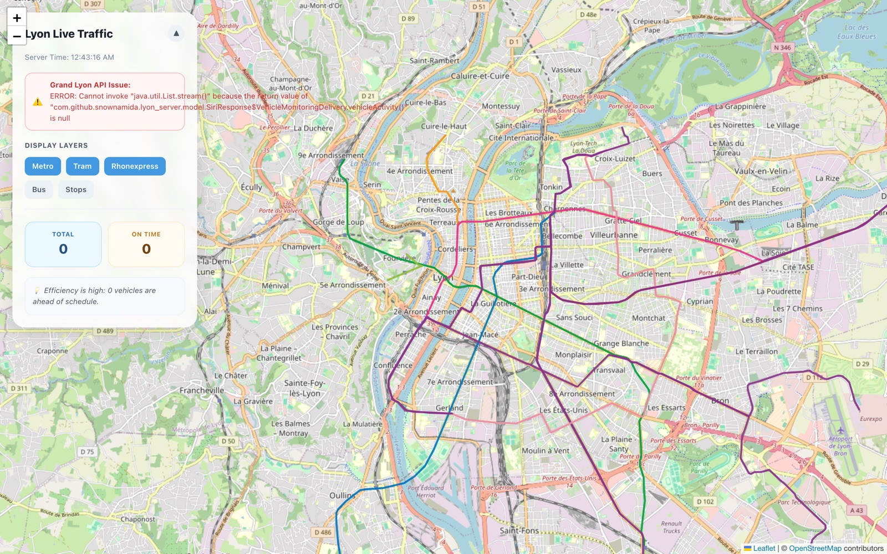

[Français](README.md) | **English**

# Lyon — Real-time TCL transit map

A real-time viewer for Lyon's public transport (the **TCL** network: bus, tram, metro),
built from the **SYTRAL** / Grand Lyon open data.

**Live demo: [lyon.snownamida.top](https://lyon.snownamida.top)**



> Screenshot taken at night: with the TCL network shut down, no vehicle is running and the
> Grand Lyon real-time feed is empty (hence the warning shown). During the day, vehicles
> appear and move across the map.

## Features

- Vehicle positions refreshed every 3 seconds on an interactive map (Leaflet / OpenStreetMap)
- Line paths (bus, tram, metro) drawn in their official colours
- Dashboard: number of vehicles per mode, punctuality (on time / late / early)
- Vehicle heading (bearing arrows) and user geolocation

## Architecture

A monorepo made of three parts:

```
lyon/
├── lyon-web/       Next.js frontend (React 19, react-leaflet, Tailwind CSS)
├── lyon-server/    Java 21 / Spring Boot backend (aggregates SYTRAL data)
└── data-example/   Samples of the SYTRAL open-data feeds (stops, lines, passages, SIRI)
```

```
SYTRAL / Grand Lyon open data
        │  (SIRI vehicle monitoring, lines & stops GeoJSON)
        ▼
lyon-server (Spring Boot)
  • GET /api/vehicles          → real-time positions + punctuality
  • GET /api/vehicles/passages → next passages
  • GET /api/lines/{type}      → GeoJSON paths (bus / tram / metro)
  • GET /healthz               → liveness probe
        │  (JSON, refreshed client-side every 3 s)
        ▼
lyon-web (Next.js) → Leaflet map in the browser
```

The frontend is deployed on **Vercel**; the backend is hosted on **Render** (free tier: a
cold start of 30 to 50 seconds is possible on the first visit).

## Local development

### Backend (`lyon-server`)

Requirements: Java 21.

```bash
cd lyon-server
./mvnw spring-boot:run
# API available at http://localhost:8080
```

Or via Docker:

```bash
cd lyon-server
docker build -t lyon-server .
docker run -p 8080:8080 lyon-server
```

### Frontend (`lyon-web`)

Requirements: Node.js 20+.

```bash
cd lyon-web
npm ci
npm run dev
# App available at http://localhost:3000
```

By default, the frontend queries `http://localhost:8080`. To point it at another backend,
set the environment variable:

```bash
NEXT_PUBLIC_API_URL=https://my-backend.example.com npm run dev
```

## Data

The data comes from the SYTRAL / Métropole de Lyon open-data feeds (data.grandlyon.com):
vehicle positions (SIRI vehicle monitoring), stops, and line paths for bus, tram,
metro/funicular and Rhônexpress. The `data-example/` folder contains samples of these
feeds for reference.

## Support the project

If you find this project useful, you can [☕ support its development on Ko-fi](https://ko-fi.com/snownamida).

## License

[MIT](LICENSE) © Snownamida
